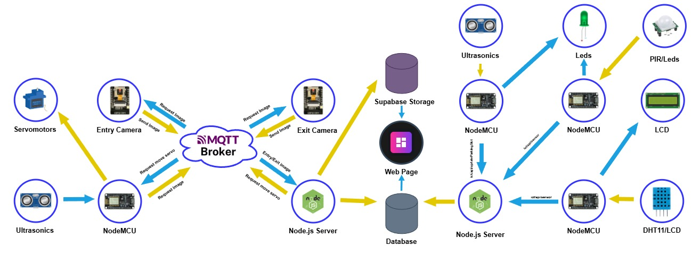

# Smart-Parking-IoT

## Overview

Smart Parking IoT is a comprehensive intelligent parking management system built on an Internet of Things (IoT) architecture. The system enables real-time acquisition, processing, and visualization of parking space occupancy to optimize infrastructure usage, reduce search times for users, mitigate environmental impact from vehicular traffic, and improve user experience through an interoperable, accessible, and scalable technological solution.

### Problem Statement

In modern cities, vehicular parking represents a critical challenge that directly impacts urban mobility, traffic operational efficiency, and quality of life. The lack of real-time information about parking space availability generates systemic problems affecting both drivers and overall city operations. Studies estimate that a driver loses an average of approximately 17 hours annually searching for parking, resulting in increased fuel consumption and carbon dioxide emissions.

### Key Features

- **Real-time Detection**: Automated parking space monitoring using HC-SR04 ultrasonic sensors
- **Wireless Communication**: ESP8266 microcontrollers transmitting data via WiFi using MQTT protocol
- **License Plate Recognition**: ESP32-CAM cameras with PlateRecognizer API integration for vehicle identification
- **Access Control Automation**: PIR sensors for vehicle detection with servo-controlled entry/exit barriers
- **Web Dashboard**: Real-time visualization platform built with Next.js and React Query
- **User Management**: Secure authentication via NextAuth.js with stay records and billing capabilities
- **Environmental Monitoring**: Temperature and humidity sensors for ambient condition tracking

## Repository Structure

```
Smart-Parking-IoT/
├── esp/                    # Sensor and actuator firmware
├── app/                    # Web application (T3 Stack)
├── mqtt-server/          # MQTT backend server
└── API_IOT2025/            # IoT sensors API
```

### `/esp` - Embedded Systems Code

Arduino/C++ firmware for ESP8266 and ESP32 microcontrollers:

- `slots.ino` - Ultrasonic sensors for parking slot availability detection
- `ultrasonic.ino` - Entry/exit detection with MQTT communication and servo gate control
- `temperature.ino` - DHT11 temperature and humidity sensor with LCD display
- `pir_sensor.ino` - PIR motion sensor for vehicle approach detection

### `/app` - Web Application

Full-stack web application built with the T3 Stack and deployed on Vercel:

- **Framework**: Next.js with TypeScript
- **API**: tRPC for type-safe API routes
- **Database**: PostgreSQL with Prisma ORM (hosted on Neon)
- **Authentication**: NextAuth.js
- **Styling**: Tailwind CSS
- **Real-time Updates**: React Query with automatic refetching

Features include:
- Real-time parking slot availability dashboard
- Temperature and humidity monitoring charts
- User stay history with entry/exit images
- Admin panel for system management
- Mobile-responsive design

### `/mqtt-server` - MQTT Backend Server

Node.js server that manages parking entry and exit operations:

- Subscribes to MQTT topics for camera image data
- Processes license plate recognition using PlateRecognizer API
- Manages user authentication based on registered plates
- Records stay entries with timestamps and images
- Stores images in Supabase Storage
- Controls gate operations via MQTT publish commands

### `/API_IOT2025` - IoT Sensors API

REST API for sensor data collection and parking slot updates. This API was originally provided by professors at Tecnológico de Monterrey and has been modified for this project.

- `POST /iot/api/sensor` - Insert sensor readings (temperature, humidity, PIR)
- `PUT /iot/api/updateParkingSlot` - Update parking slot availability

Built with Express.js and PostgreSQL (pg driver).

## Architecture Diagram



## Tech Stack

| Layer | Technology |
|-------|------------|
| Hardware | ESP8266, ESP32-CAM, HC-SR04, DHT11, PIR, Servo motors |
| Communication | MQTT, WiFi, HTTP REST |
| Backend | Node.js, Express.js, tRPC |
| Database | PostgreSQL (Neon), Prisma ORM |
| Storage | Supabase Storage |
| Frontend | Next.js, React, Tailwind CSS |
| Authentication | NextAuth.js |
| Deployment | Vercel |
| External APIs | PlateRecognizer |

## Alignment with UN Sustainable Development Goals

This project aligns with:
- **SDG 11**: Sustainable Cities and Communities
- **SDG 9**: Industry, Innovation and Infrastructure  
- **SDG 13**: Climate Action

By reducing time spent searching for parking, the system contributes to lower emissions, reduced traffic congestion, and more efficient use of urban infrastructure.

